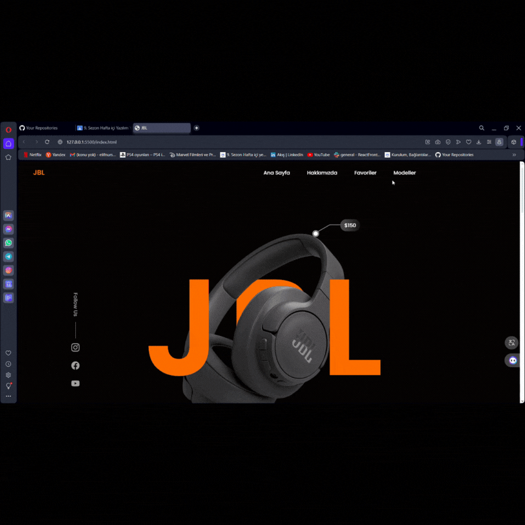

# JBL CLONE

-This project aims to create a clone of the homepage of JBL's official website. Developed using HTML and CSS, this clone includes essential elements showcasing JBL's products and campaigns. Key sections such as the header, menu options, latest products, and campaigns have been organized to reflect the design and layout of the original JBL homepage. Additionally, responsive design features have been added to adapt to various screen sizes.

-This project can serve as an interactive learning tool for those looking to enhance their web development skills. The content of the HTML and CSS files can be used as a starting point for your own projects or further customization.

## How to Run
- You can run the project by cloning it to your computer or downloading the ZIP file and following these steps:

1. Clone the repository to your computer: 'git clone https://github.com/username/trendyol-like-site.git' 
2. Navigate to the project directory: 'cd trendyol-like-site'
3. Open the 'index.html' file in a web browser.

## GIF 

